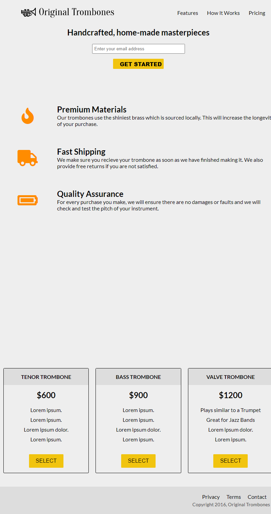

# Project Name

> This is one of required projects to earn your certification, and for your product landing page to market a product of your choice.



## Built With

- HTML5 form elements
- `h1`,`h2`,`p`, `select`, `form`, `button`, `div`, `span`
- `footer`, `lo`, `ìnput`, `li`, `iframe`,.
- CSS properties
- CSS Background for page aesthetic using background-color, `background-image`,
  `box-shadow`, `background-position`,
  background-repeat
  `text-shadow`, etc.
- `CSS Typography properties font-size`, `font-style`, `font-family`, `text-align`, `color`, etc
- `CSS Box Model properties padding`, `margin`, `width`,`line-height`, `box-sizing`,`border` etc
- CSS Positioning properties
  `position`, `relative`, `fixed`, `blocked`,etc.
- CSS Transitioning properties
  `transition`.

## Live Demo

[Live Demo Link](https://17-fcc-product-landing-page.netlify.app/livedemo.com)

### Development (Running locally)

- Clone the project

```bash
git git@github.com:olayinka-oladele/17-fcc-product-landing-page.git

```

- Install Dependencies

```bash
yarn install
```

To run StyleLint by itself, you may run the lint task:

```bash
yarn lint:check
```

Or to automatically fix issues found (where possible):

```bash
yarn lint
```

You can also check against Prettier:

```bash
yarn format:check
```

and to have it fix (to the best of its ability) any format issues, run:

```bash
yarn format
```

You can also check against Webhint:

```bash
yarn hint
```

## Style Guides

- [CSS Style Guide](http://udacity.github.io/frontend-nanodegree-styleguide/css.html)
- [HTML Style Guide](http://udacity.github.io/frontend-nanodegree-styleguide/index.html)

## 👤 Author

- Github: [@olayinka-oladele](https://github.com/olayinka-oladele)
- Freecodecamp: [@olayinka-oladele](https://freecodecamp.com/author)
- Linkedin: [@olayinka-oladele](https://www.linkedin.com/in/author/)
- Instagram: [@olayinka-oladele](https://instagram.com/drhappylinkolayinka?igshid=YWYwM2I1ZDdmOQ==)

## 🤝 Contributing

Contributions, issues and feature requests are welcome!

Feel free to check the [issues page](../../issues).

## Show your support

Give a ⭐️ if you like this project!

## Acknowledgments

- https://www.freecodecamp.org/learn/2022/responsive-web-design/build-a-product-landing-page-project/build-a-product-landing-page

## 📝 License

[MIT licensed](./LICENSE).
